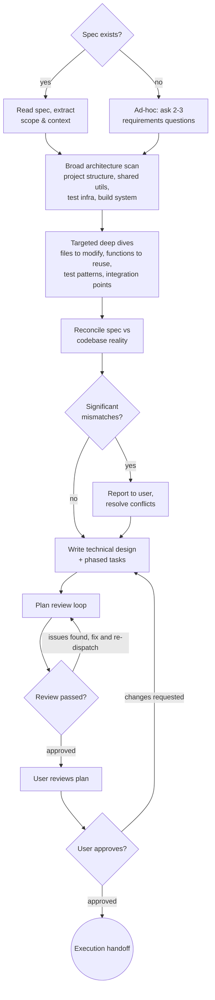

# Plan: Codebase-Aware Implementation Planning

Write implementation plans that are grounded in what actually exists. Before writing a single task, scan the codebase to find reusable code, understand established patterns, and avoid reinventing what's already built.

**Announce at start:** "I'm using the plan skill to create a codebase-aware implementation plan."

**Save plans to:** `docs/plans/YYYY-MM-DD-<feature-name>.md` (user preferences override this default)

## Checklist

You MUST create a task for each of these items and complete them in order:

1. **Ingest spec** (or gather requirements ad-hoc)
2. **Codebase scan** — broad architecture scan + targeted deep dives
3. **Reconcile** — cross-check spec assumptions against codebase reality
4. **Write plan** — technical design + phased implementation tasks with concrete code
5. **Review & handoff** — plan review loop, user approval, execution handoff

## Process Flow



---

## Phase 1: INGEST SPEC

### If spec exists:
- Read the spec file
- Extract the **Codebase Context** section (research findings from pair-brainstorm)
- Extract **User Stories** with priorities — these define the plan's phases
- Extract scope, constraints, boundaries, and success criteria
- Note the **Decisions Log** — these decisions are settled; do not re-open them
- Note **Open Questions** — these need to be resolved during planning

### If no spec (ad-hoc mode):
- Ask 2-3 focused requirements questions:
  - What are you building? (scope)
  - What constraints exist? (technical limits, patterns to follow)
  - What does "done" look like? (success criteria)
- Then proceed to Phase 2

### Scope Check
If the spec (or ad-hoc scope) covers multiple independent subsystems, suggest breaking into separate plans — one per subsystem. Each plan should produce working, testable software on its own.

---

## Phase 2: CODEBASE SCAN

Two-pass scan. Dispatch parallel subagents for different areas.

### Pass 1: Broad Architecture Scan
Understand the project landscape:
- **Project structure:** directory layout, module organization, key config files
- **Shared utilities:** common modules, helper functions, base classes
- **Test infrastructure:** test runner, fixtures, mocks, test patterns
- **Build system:** build tools, dependency management, CI/CD
- **Code conventions:** naming, file organization, error handling patterns

### Pass 2: Targeted Deep Dives
Zoom into areas the spec touches:
- **Files to modify or extend:** read them, understand their structure
- **Functions to reuse:** identify specific functions/classes that can be leveraged
- **Existing test patterns:** how are tests written for similar functionality?
- **Integration points:** where does this feature connect to existing code?

**Dispatch subagents freely.** Examples:
- One agent scans shared utilities and common patterns
- Another explores the specific modules the spec targets
- A third reviews test infrastructure and conventions

---

## Phase 3: RECONCILE

Cross-check the spec's assumptions against what you actually found. This phase catches the "plans in a vacuum" problem.

### Validate Assumptions
- Does the spec's Codebase Context match reality?
- Are the "established patterns" it references still current?
- Are the "reusable components" it lists still available and appropriate?

### Identify Reuse Opportunities
- Functions/modules the spec missed that could reduce implementation work
- Existing test utilities that can be leveraged
- Patterns in adjacent code that should be followed

### Flag Conflicts
- Proposed architecture conflicting with existing patterns
- Data flow assumptions that don't match actual interfaces
- Dependencies that have changed since the spec was written

### Report
- **If no significant mismatches:** proceed silently to Phase 4
- **If significant mismatches found:** report to the user with specifics:
  > "The spec says X, but the codebase actually does Y. This affects the design because Z. How should we proceed?"

  Wait for the user to resolve the conflict before proceeding.

---

## Phase 4: WRITE PLAN

### Plan Document Header
Every plan MUST start with:

```markdown
# [Feature Name] Implementation Plan

> **For agentic workers:** Use superpowers:subagent-driven-development (recommended) or superpowers:executing-plans to implement this plan task-by-task. Steps use checkbox (`- [ ]`) syntax for tracking.

**Goal:** [One sentence describing what this builds]

**Tech Stack:** [Key technologies/libraries]

**Spec Reference:** [path to spec if one exists]

---
```

### Technical Design

**This section is the HOW** — architecture, data models, API contracts, error handling. It contains concrete types, routes, and error behavior that executing agents implement against. The contract is rigid; the implementation is flexible.

```markdown
## Technical Design

### Architecture
<!-- High-level component structure: what are the main pieces and how do they relate?
     2-3 sentences + a list of components with one-line descriptions. -->

### Data Model
<!-- Concrete types/interfaces — agents use these exactly.
     Include field names, types, relationships. -->

### API Contracts (if applicable)
<!-- Exact routes, request/response shapes, error codes.
     Agents don't invent these — they implement what's here. -->

### Error Handling
<!-- Specific error scenarios and exact responses.
     "Timeout after 30s → set status='failed'" not "handle timeouts appropriately" -->

### Testing Strategy
<!-- What to test at each level: unit, integration, e2e.
     Reference specific functions/components. -->
```

**Detail level guidance:** Include concrete types with field names, exact API routes with request/response shapes, specific error scenarios with exact responses. Do NOT prescribe function bodies — that's what the task steps are for.

### File Structure
Before defining tasks, map out which files will be created or modified:
- Design units with clear boundaries and well-defined interfaces
- Each file should have one clear responsibility
- Follow established codebase patterns
- Reference specific existing files discovered in the codebase scan

### Phased Task Structure

Tasks are organized into phases aligned with the spec's user stories. Each phase ends with a checkpoint — a working, testable increment.

**Task format:** `- [ ] T001 [P?] [US?] Description with exact file path`
- `[P]` = parallelizable (different files, no dependencies — can dispatch to parallel subagents)
- `[US1]` = which user story this task serves

````markdown
## Phase 1: Setup
- [ ] T001 Create project structure per technical design
- [ ] T002 [P] Configure dependencies

## Phase 2: Foundation (blocking prerequisites)
- [ ] T003 [foundation description with file path]

**Checkpoint:** Foundation ready, base infrastructure works

## Phase 3: [US1 Story Title] (P1 — MVP)
**Goal:** [from spec's US1]

### Tests (write ALL first — one test per task, discover edge cases)
Each test is one behavior. Include complete, executable test code written against the Technical Design's interfaces. Actively look for edge cases beyond what the spec listed.

- [ ] T004 [US1] Test: [spec acceptance criterion 1]

```python
def test_filtered_export_includes_only_matching_rows():
    # test code against Technical Design interfaces
    ...
```

- [ ] T005 [US1] Test: [spec acceptance criterion 2]

```python
def test_user_can_choose_filename_and_destination():
    ...
```

- [ ] T006 [US1] Test: [edge case discovered while writing tests]

```python
def test_empty_dataset_after_filter_exports_headers_only():
    ...
```

- [ ] T007 [US1] Run full test suite — verify all FAIL (not error)

Run: `pytest tests/path/test_us1.py -v`
Expected: All tests FAIL (missing implementation). If any test ERRORS, fix the test first — errors mean broken test code, not missing behavior.

### Implementation (make tests green one by one)
Each task references which test(s) it makes green by task ID.

- [ ] T008 [US1] Implement [core component] in `path/to/file` → T004, T005 pass

```python
def function(input):
    return expected
```

- [ ] T009 [US1] Handle [edge case] in `path/to/file` → T006 passes

```python
# edge case handling code
```

- [ ] T010 [US1] Run full suite — verify ALL green + no regressions

Run: `pytest tests/path/test_us1.py -v`
Expected: ALL PASS

- [ ] T011 [US1] Refactor while green (clean up, extract helpers, improve names)
- [ ] T012 [US1] Run full suite — verify still ALL green after refactor
- [ ] T013 [US1] Commit

**Checkpoint:** US1 independently functional — can stop here and have shippable software

## Phase 4: [US2 Story Title] (P2)
[Same structure as Phase 3: Tests first, then Implementation]

## Phase N: Polish
- [ ] TXXX [P] Final integration test across all user stories
- [ ] TXXX [P] Cleanup
````

### Task Granularity
- **Tests-first:** Write ALL tests for a phase before any implementation. Tests are the executable specification.
- **One behavior per test task** — each test task has one test function with complete code
- **Edge case discovery** — actively look for edge cases while writing tests, beyond what the spec listed
- **Implementation references tests** — each implementation task says which test(s) it makes green (e.g., "→ T004, T005 pass")
- **Refactor step** — after all tests are green, refactor while staying green, verify, then commit
- **FAIL vs ERROR** — when running the full suite after writing tests, all tests should FAIL (missing behavior), not ERROR (broken test code)
- Complete code in plan (not "add validation" — show the validation code)
- Exact commands with expected output
- **MVP-first:** You can stop after Phase 3 and have shippable software

### Carrying Forward Decisions
- The plan inherits the spec's Decisions Log
- Do NOT re-open settled decisions
- If the codebase scan reveals new information that challenges a decision, flag it in Phase 3 (RECONCILE), don't silently override

---

## Phase 5: REVIEW & HANDOFF

### Plan Review Loop
1. Dispatch plan-reviewer subagent (see `skills/plan/plan-reviewer-prompt.md`) with precisely crafted context
2. If Issues Found: fix, re-dispatch, repeat until Approved
3. Max 3 iterations, then surface to human for guidance

### User Review
Present the plan:

> "Plan written and committed to `<path>`. Please review and let me know if you want changes before we start implementation."

Wait for user response. If changes requested, make them and re-run review loop.

### Execution Handoff
After user approves:

> "Plan approved. Two execution options:
>
> **1. Subagent-Driven (recommended)** — I dispatch a fresh subagent per task, review between tasks, fast iteration
>
> **2. Inline Execution** — Execute tasks in this session with checkpoints for review
>
> Which approach?"

**If Subagent-Driven:** Use superpowers:subagent-driven-development
**If Inline Execution:** Use superpowers:executing-plans

---

## Key Principles

- **Always scan the codebase before planning** — even if the spec has a Codebase Context section, verify it
- **Technical Design before tasks** — concrete types, API contracts, and error handling BEFORE implementation steps
- **Phased by user story** — each phase maps to a spec user story, each ends with a checkpoint
- **Reference specific files and functions** in every task — no generic "implement the component" steps
- **Carry forward decision rationale** — don't re-open settled decisions from the spec
- **Dispatch subagents freely** — for parallel codebase exploration
- **Reconcile before writing** — catch spec/codebase mismatches early
- **DRY, YAGNI, TDD** — same engineering principles, now grounded in real code
- **Exact file paths, complete code, exact commands** — the engineer following this plan should never have to guess
